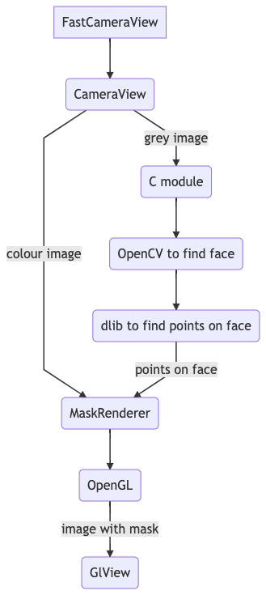

# MakeUp

## What is it?

This is android application that I wrote. It is VR application, it uses stream from camera, and add to face effects for make-up: it could paint lips, eyes, eyelashes.

# Table of Contests

- [What is it?](#what-is-it)
- [Settings](#settings)

## Settings

You should download trained shape predictor file from [here](http://dlib.net/files/shape_predictor_68_face_landmarks.dat.bz2) or could trian it by yourself. Unzip it, rename it to sp68.dat and put in dir [assets](https://github.com/oleg-sta/Masks/tree/master/assets). This file is very large so I don't store on version control. Yes, it's bad, but I made simple bad solution.
Make settings to submodule [commonLib](https://github.com/oleg-sta/commonLibMask).

## How it works

It is a very complex application that uses camera, machine learning libraries written on C, OpenGL scripts and it should work very fast because it works online. You could read about main logic in my submodule [here](https://github.com/oleg-sta/commonLibMask) with all description of logic in it.

Application could be described by picture below:
